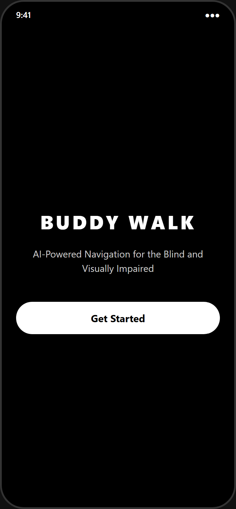
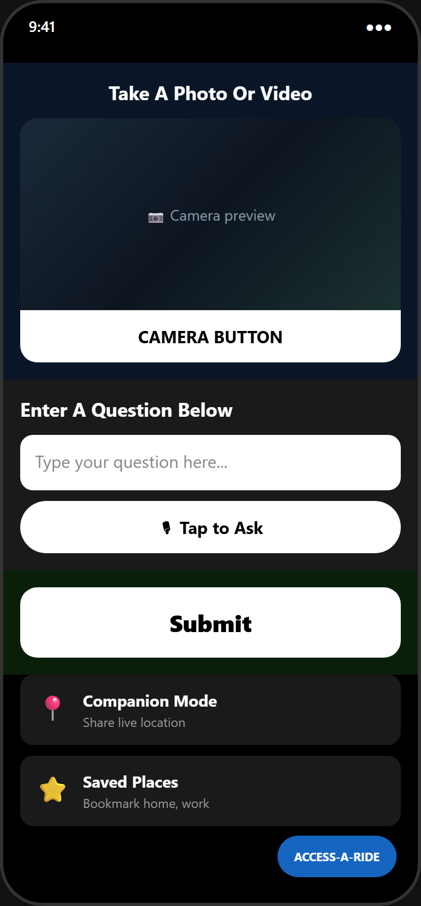
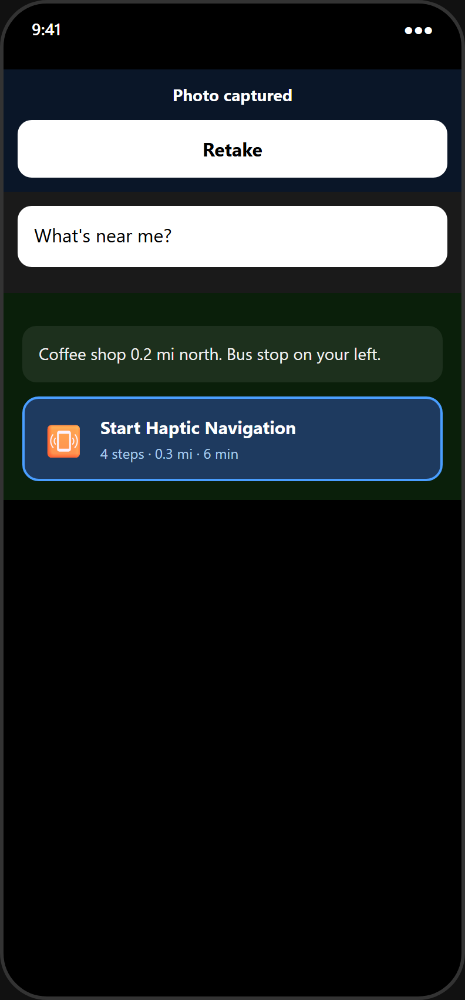
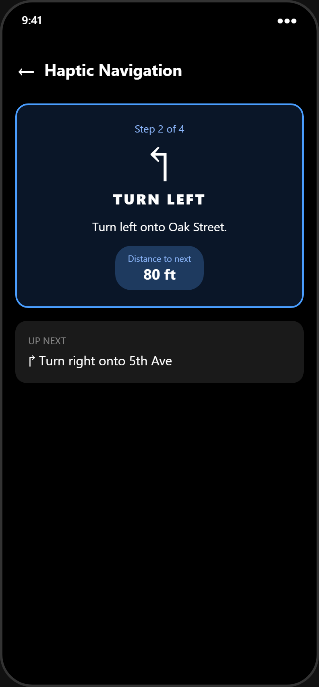
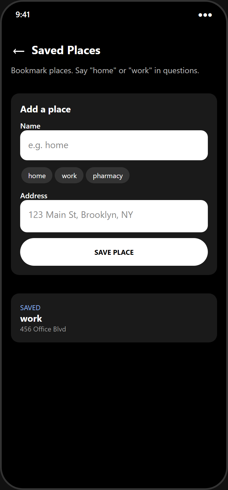
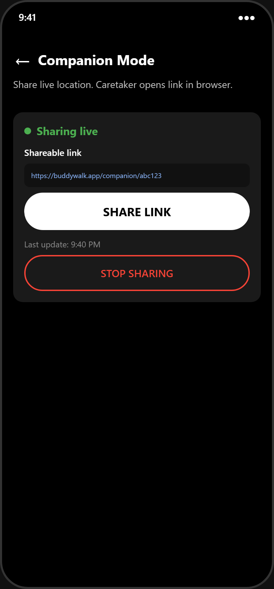
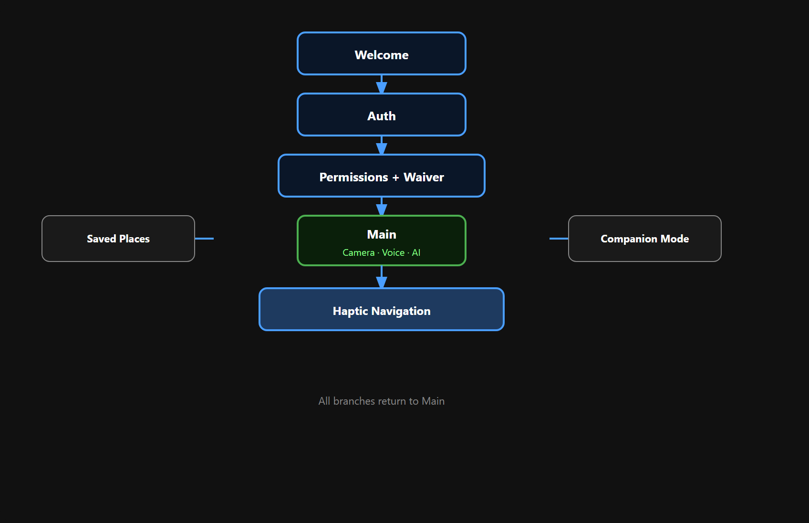

# Buddy Walk Mobile

**Accessibility-first navigation for blind and low-vision travelers** — capture your surroundings, ask questions by voice or text, hear AI answers aloud, and walk with **haptic turn-by-turn** guidance. Built with **Expo / React Native** for iOS and Android.

| | |
|---|---|
| **Live docs** | [https://justraymond99.github.io/buddy_walk/](https://justraymond99.github.io/buddy_walk/) — enable once: **Settings → Pages → Build and deployment → Source: GitHub Actions**, then push `main` (workflow: [.github/workflows/deploy-pages.yml](.github/workflows/deploy-pages.yml)) |
| **App source** | [`mobile/`](mobile/) |
| **Setup** | [mobile/README.md](mobile/README.md) |

---

## Screenshots

<p align="center">
  
  
  
  
</p>

<p align="center">
  
  
</p>

<p align="center"><em>Welcome · Main · AI + route · Navigation · Saved places · Companion</em></p>

<p align="center">
  
</p>

---

## What it does

Instead of juggling a camera app, maps, and a screen reader, Buddy Walk Mobile combines:

- **Onboarding** — welcome, Firebase sign-in, permissions, waiver
- **AI Q&A** — photo or hold-for-video, voice (Azure STT) or typed questions, spoken answers
- **Haptic navigation** — directions parsed into steps with GPS, speech, and distinct vibrations per turn
- **Saved places** — nicknames like “home” or “work” for shorter questions
- **Companion mode** — share a link so someone can follow live location in the browser
- **Safety & a11y** — offline alerts, shake-to-mic, screen-reader labels, Access-A-Ride quick dial

---

## Quick start

```bash
cd mobile
npm install
cp .env.example .env   # set EXPO_PUBLIC_API_URL=http://<YOUR_LAN_IP>:8000
npx expo start
```

Scan the QR code with **Expo Go** on a physical phone (same Wi‑Fi as your dev machine). The backend must be running — see [mobile/README.md](mobile/README.md).

---

## Example questions

- Where am I?
- What coffee shops are nearby?
- How do I walk to [address or saved place]?
- How far am I from [place]?
- Describe what you see in this photo

---

## Project layout

```
Buddy_Walk/
├── mobile/          ← Expo app (primary deliverable)
│   ├── src/screens/
│   ├── src/hooks/useTurnByTurnNavigation.ts
│   └── src/test/    ← 19 unit tests (npm test)
├── docs/            ← GitHub Pages + README screenshots
└── src/             ← legacy Vite web prototype (reference)
```

---

## Tech stack

| Layer | Tools |
|-------|--------|
| Mobile | Expo SDK 54, React Native, React Navigation, React Native Paper |
| Device | expo-camera, expo-location, expo-speech, expo-sensors, expo-network |
| Auth | Firebase |
| Backend | Express API (OpenAI, Azure Speech token, companion sessions) |
| Config | `EXPO_PUBLIC_API_URL` — use your PC’s LAN IP, not `localhost` |

---

## Legacy web app

The original Buddy Walk prototype is a Vite + React web client in the repo root (`src/`). The **mobile app** in `mobile/` is the current focus: native camera, haptics, and sensors on real devices.
